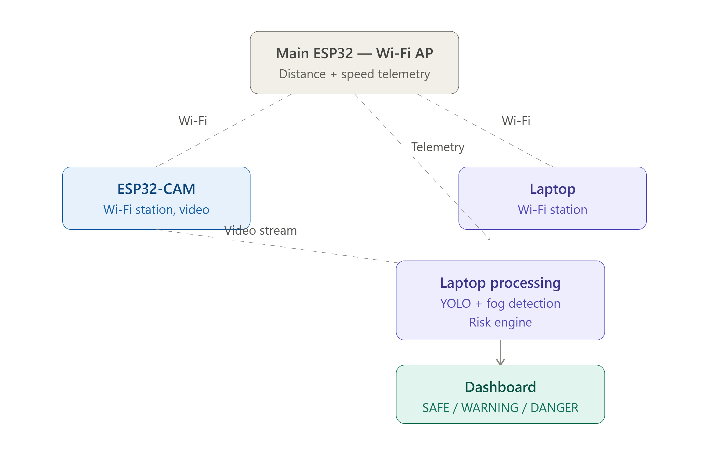
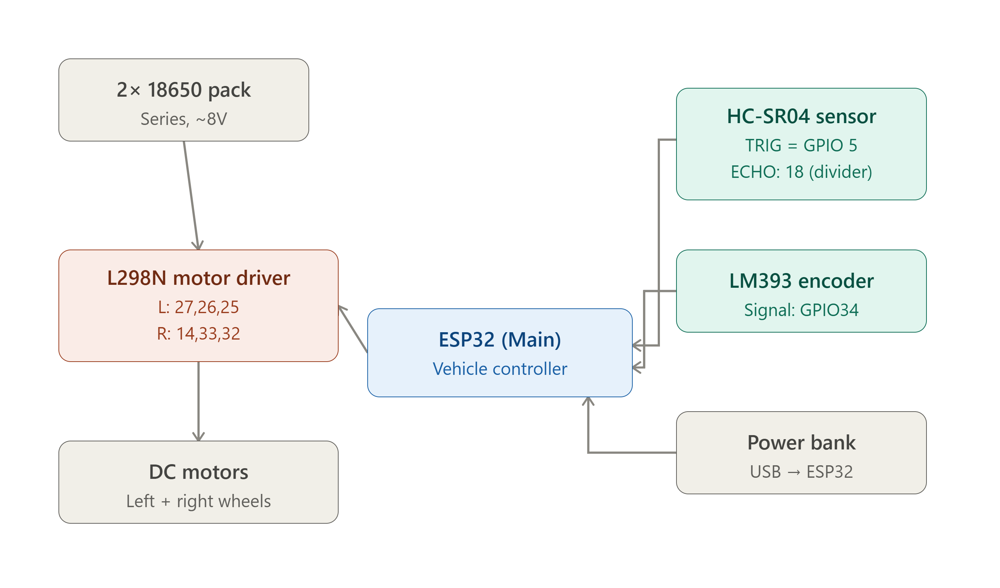

# MineGuard – System Architecture

This document explains how MineGuard's hardware and software components work together. For the raw pin-level wiring, see [`hardware/pin_connections.md`](../hardware/pin_connections.md) and [`hardware/hardware_setup.md`](../hardware/hardware_setup.md).

## 1. Overview

MineGuard has three physical parts that communicate over Wi-Fi:

1. **Main ESP32** — controls the vehicle's motors, reads the ultrasonic distance sensor and wheel-speed encoder, and hosts a Wi-Fi Access Point.
2. **ESP32-CAM** — a separate board that streams live video, connecting to the Main ESP32's Wi-Fi network as a client.
3. **Laptop** — connects to the same Wi-Fi network, runs the AI vision (YOLO), fog detection, and the risk engine, and displays everything on a dashboard.

The driver always controls normal vehicle movement manually. MineGuard does not drive the vehicle — it senses, calculates risk, and warns. It only intervenes automatically for an emergency stop when risk becomes critical.

## 2. Hardware wiring

The electrical connections (which GPIO pin drives which component) are shown below and documented in full in `hardware/pin_connections.md`.

Key points:
- The 2× 18650 battery pack powers only the L298N motor driver's output stage — it does **not** power the ESP32 itself.
- The Main ESP32 is powered separately (via a power bank over USB), and in turn powers the HC-SR04 and LM393 modules from its own 5V/3.3V rails.
- The ESP32-CAM has its own, fully independent power bank.
- HC-SR04's ECHO line passes through a 1kΩ/2.2kΩ voltage divider before reaching the ESP32, to safely step the 5V signal down to 3.3V.

## 3. Network / data flow

The Main ESP32, ESP32-CAM, and laptop are connected only wirelessly — there is no electrical wire between them. This is shown separately from the wiring diagram because Wi-Fi is a data connection, not an electrical one.

- The Main ESP32 hosts a Wi-Fi Access Point.
- The ESP32-CAM joins that network as a station (client) and streams video to the laptop.
- The laptop also joins the same network to pull distance/speed telemetry from the Main ESP32.
- The laptop runs YOLO object detection, fog/visibility analysis, and the risk engine, then displays the result on the dashboard.

## 4. Functional / decision architecture

This diagram shows how raw sensor data becomes a safety decision — independent of which physical board or wire is involved.

Flow:
1. **Distance** (HC-SR04), **speed** (LM393 encoder), and **vision** (YOLO + fog detection) are the three sensing inputs.
2. The **integration controller** (`integration_controller.py`) combines the latest values from all three into one consistent system state.
3. The **risk engine** (`risk_engine.py`) uses object type, distance, vehicle speed, and time-to-collision (TTC) to compute a risk score.
4. That score becomes a **risk decision**: SAFE, WARNING, or DANGER, along with a recommended action (MOVE / SLOW / STOP) and a recommended speed.
5. The decision always updates the **dashboard**. Only a DANGER/critical decision also triggers the **emergency stop** — a hard safety override on top of the driver's manual control.

## 5. Software module map

| File | Role |
|---|---|
| `ai_detector.py` | Runs YOLO object detection on the ESP32-CAM video stream |
| `fog_detection.py` | Analyses the video for reduced/poor visibility |
| `read_telemetry.py` | Reads distance + speed telemetry from the Main ESP32 |
| `risk_engine.py` | Computes risk score, decision, and recommended action |
| `integration_controller.py` | Combines all inputs and drives the overall system state |
| `dashboard.py` | Displays the live system state to the operator |

## 6. Scaling beyond the prototype

This prototype validates the core sensing → risk → decision logic. See the README's [Industrial Vision & Scalability](../README.md#13-industrial-vision--scalability) section for how this architecture is intended to scale to radar/LiDAR sensing, fleet-wide vehicle-to-vehicle awareness, and a central mine safety dashboard.
